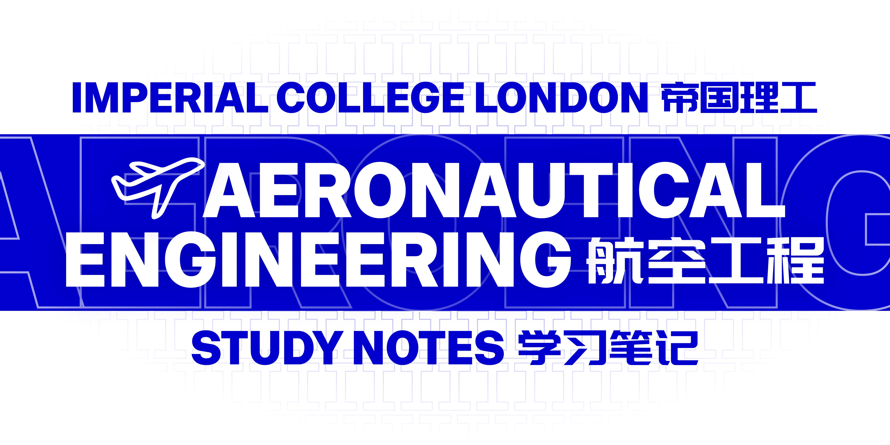

*All notes and tutorial solutions are my own work and are shared for learning purposes only*  
*No assessed or examination materials are included in this repository*  
*所有笔记与习题解答均由本人独立完成，仅用于学习与交流目的*  
*本仓库中不包含任何与评分作业或考试有关的材料*  

*Contributions from others will be [credited](Contributing.md#acknowledgements---致谢) in italics in this README*  
*来自其他贡献者的内容将在本README中以斜体形式标注并[致谢](Contributing.md#acknowledgements---致谢)*  

The quality of my Year 1 materials is a bit meh...I was still figuring things out and never got around to polishing it  
Trust me, things take a major step up from Year 2 onwards  
整理时发现自己大一笔记和习题的质量有些一言难尽...但我实在抽不出时间重写一遍了  
相信我，从大二开始，学习资料有质的飞跃

I‘d be eternally, infinitely, cosmically grateful if anyone could contribute or help fix any errors, pls see [Contributing](Contributing.md)  
如果您愿意补充上传更多资料或修正您发现的错误，我将超级无敌宇宙感激，详情请看[贡献](Contributing.md) 

## [Year 1 - 大一](Year%201/) (2022-2023)
* **AERO40001 - Aerodynamics 1 - 空气动力学 1**  
  * [Study Notes](Year%201/AERO40001%20-%20Aerodynamics%201/Aerodynamics%201.pdf) - 学习笔记
  * [Tutorial](Year%201/AERO40001%20-%20Aerodynamics%201/Tutorial) - 习题
* **AERO40002 - Introduction to Aerospace - 航空航天概论**  
  * [Tutorial](Year%201/AERO40002%20-%20Introduction%20to%20Aerospace/Tutorial) - 习题
* **AERO40003 - Computing and Numerical Methods 1 - 计算机与数值方法 1**  
  * Study Notes
    * [MATLAB](Year%201/AERO40003%20-%20Computing%20and%20Numerical%20Methods%201/Study%20Notes/MATLAB)
    * [Python](Year%201/AERO40003%20-%20Computing%20and%20Numerical%20Methods%201/Study%20Notes/Python)
  * Tutorial - 习S
    * [MATLAB](Year%201/AERO40003%20-%20Computing%20and%20Numerical%20Methods%201/Tutorial/MATLAB)
    * [Numerical Methods](Year%201/AERO40003%20-%20Computing%20and%20Numerical%20Methods%201/Tutorial/Numerical3%20Methods) - 数值方法
    * [Python](Year%201/AERO40003%20-%20Computing%20and%20Numerical%20Methods%201/Tutorial/Python)
* **AERO40004 - Engineering Practice 1 - 工程实践 1**  
  * [Logbook](Year%201/AERO40004%20-%20Engineering%20Practice%201/Logbook) - 实验日志
* **AERO40005 - Materials 1 - 材料学 1**  
  * *[Study Notes](Contributing.md#haozeeeeeeeee) - 学习笔记*
  * Tutorial - 习题
    * [Introduction](Year%201/AERO40005%20-%20Materials%201/Tutorial/Introduction) - 概论
    * [Elasticity and Plasticity](Year%201/AERO40005%20-%20Materials%201/Tutorial/Elasticity%20and%20Plasticity) - 弹性与塑性
* **AERO40006 - Mathematics 1 - 数学 1**  
  * [Study Notes](Year%201/AERO40006%20-%20Mathematics%201/Mathematics%201.pdf) - 学习笔记
  * Tutorial - 习题
    * [Introduction](Year%201/AERO40006%20-%20Mathematics%201/Tutorial/Introduction) - 入门
    * [Ordinary Differential Equations](Year%201/AERO40006%20-%20Mathematics%201/Tutorial/Ordinary%20Differential%20Equations) - 常微分方程
    * [Linear Algebra](Year%201/AERO40006%20-%20Mathematics%201/Tutorial/Linear%20Algebra) - 线性代数
* **AERO40007 - Mechanics 1 - 力学 1**  
  * *[Study Notes](Contributing.md#haozeeeeeeeee) - 学习笔记*
  * Tutorial - 习题
    * [Part 1](Year%201/AERO40007%20-%20Mechanics%201/Tutorial/Part%201) - 第一部分
    * [Part 2](Year%201/AERO40007%20-%20Mechanics%201/Tutorial/Part%202) - 第二部分
* **AERO40008 - Structures 1 - 结构学 1**  
  * [Study Notes](Year%201/AERO40008%20-%20Structures%201/Structures%201.pdf) - 学习笔记
  * Tutorial - 习题
    * [Part 1](Year%201/AERO40008%20-%20Structures%201/Tutorial/Part%201) - 第一部分
    * [Part 2](Year%201/AERO40008%20-%20Structures%201/Tutorial/Part%202) - 第二部分
* **AERO40009 - Thermodynamics and Heat Transfer - 热力学与热传导**  
  * [Study Notes](Year%201/AERO40009%20-%20Thermodynamics%20and%20Heat%20Transfer/Thermodynamics%20and%20Heat%20Transfer.pdf) - 学习笔记
  * [Tutorial](Year%201/AERO40009%20-%20Thermodynamics%20and%20Heat%20Transfer/Tutorial) - 习题

## [Year 2 - 大二](Year%202/) (2023-2024)  
* **[AERO50001 - Aerodynamics 2](Year%202/AERO50001%20-%20Aerodynamics%202.pdf) - 空气动力学 2**    
* **[AERO50002 - Flight Dynamics and Control](Year%202/AERO50002%20-%20Flight%20Dynamics%20and%20Control.pdf) - 飞行动力学与控制原理**  
* **[AERO50005 - Materials 2](Year%202/AERO50005%20-%20Materials%202.pdf) - 材料学 2**   
* **AERO50006 - Mathematics 2 - 数学 2**
  * [Vector Calculus](Year%202/AERO50006%20-%20Vector%20Calculus.pdf) - 向量微积分
  * [Partial Differential Equation (PDE)](Year%202/AERO50006%20-%20Partial%20Differential%20Equations.pdf) - 偏微分方程
  * [Probability](Year%202/AERO50006%20-%20Probability.pdf) - 概率学
  * [Signals and Systems](Year%202/AERO50006%20%26%20AERO50007%20-%20Signals%20and%20Systems.pdf) (Part 1) - 信号与系统 (第一部分)
* **AERO50007 - Mechatronics - 机电一体化**
  * [Signals and Systems](Year%202/AERO50006%20%26%20AERO50007%20-%20Signals%20and%20Systems.pdf) (Part 2) - 信号与系统 (第二部分)
  * [Circuit](Year%202/AERO50007%20-%20Circuit.pdf) - 电路
* **[AERO50008 - Structures 2](Year%202/AERO50008%20-%20Structures%202.pdf) - 结构学 2**  
* **[AERO50009 - Propulsion and Turbomachinery](Year%202/AERO50009%20-%20Propulsion%20and%20Turbomachinery.pdf) - 推进系统与涡轮机**  

## [Year 3 - 大三](Year%203/) (2024-2025)  
* **[AERO60001 - Aerodynamics 3](Year%203/AERO60001%20-%20Aerodynamics%203.pdf) - 空气动力学 3**  
* **[AERO60007 - Control Systems](Year%203/AERO60007%20-%20Control%20Systems.pdf) (Part 2) - 控制系统 (第二部分)**  
* **[AERO60008 - Structures 3](Year%203/AERO60008%20-%20Structures%203.pdf) - 结构学 3**  
* **[AERO70015 - Mathematics 3](Year%203/AERO70015%20-%20Mathematics%203.pdf) *(elective)* - 数学 3 *(选修)***  
* **[AERO70038 - Introduction to Vertical Flight](Year%203/AERO70038%20-%20Introduction%20to%20Vertical%20Flight.pdf) *(elective)* - 垂直飞行概论 *(选修)***  

## Year 4 - 研一 (2025-2026)  
will update before August 2026   
将于2026年8月前更新  
&nbsp;

## Modules Covered by External References - 由外部参考资料覆盖的课程
### Year 1 - 大一
* **AERO40002 - Introduction to Aerospace - 航空航天概论**  
  Suggested reading awesome [Intro to Aerospace study notes](https://www.aerostudents.com/) compiled by students from Delft University of Technology  
  推荐阅读由代尔夫特理工大学毕业生们整理的[航空航天概论学习笔记](https://www.aerostudents.com/)，非常之牛逼
* **AERO40003 - Computing and Numerical Methods 1 - 计算机与数值方法 1**  
  [W3Schools](https://www.w3schools.com/) provides detailed and systematic tutorials for MATLAB and Python  
  [菜鸟教程](https://www.runoob.com/) 给出了系统且免费的MATLAB与Python教程
* **AERO40004 - Engineering Practice 1 - 工程实践 1**  
  Honestly, any Large Language Model would be far more helpful than my notes or the code I have written  
  任何大语言模型都比我的笔记或屎山代码好使多了
### Year 2 - 大二
* **AERO50003 - Computing and Numerical Methods 2 - 计算机与数值方法 2**  
  [W3Schools](https://www.w3schools.com/) provides a detailed and systematic C++ tutorial  
  [菜鸟教程](https://www.runoob.com/) 给出了系统且免费的C++教程
* **AERO50010 - Engineering Practice 2 - 工程实践 2**  
  Once again, any Large Language Model would be much more helpful than my notes or previously written code  
  说真的，任何大语言模型都比我的笔记或屎山代码好使多了
### Year 3 - 大三
* **AERO60002 - Aerospace Vehicle Design - 飞行器设计**  
  If you really need it, I can make the repositories public, but if you dare to simply copy and paste my code instead of learning the methodology behind it, I will find you and fold you like a lawn chair  
  如果你真的需要，我可以公开自己的仓库，但如果你敢直接照抄，无论你在地球的哪个角落，我都会找到你，然后抡起铜头皮带把你抽得如陀螺般旋转
* **AERO60004 - Aeronautics Group Design Project - 小组设计项目**  
  If you select a group design project related to vertical flight, especially helicopters, you can directly refer to the project I worked on [here](https://github.com/GH-X-ST/HALO)  
  如果你选择了与垂直飞行（特别是与直升机）有关的小组设计，我恰好参与过一个，看[这儿](https://github.com/GH-X-ST/HALO)
* **AERO60007 - Control Systems (Part 1) - 控制系统 (第一部分)**  
  You can read *Feedback Systems: An Introduction for Scientists and Engineers*   
  去读读《反馈系统：多学科视角 *(Feedback Systems: An Introduction for Scientists and Engineers)*》吧  
&nbsp;
